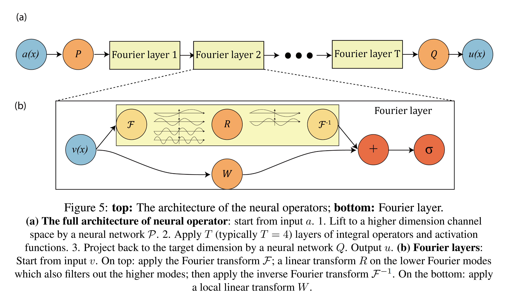

<!-- _class: lead gaia -->

# Neural operator: learning maps between function spaces with applications to PDEs

Nikola Kovachki, Zongyi Li,  Burigede Liu,  Kamyar Azizzadenesheli, Kaushik Bhattacharya, Andrew Stuart, and Anima Anandkumar

[Journal of Machine Learning Research 24 (2023) Paper](https://www.jmlr.org/papers/volume24/21-1524/21-1524.pdf)

---

<!-- _class: gaia -->

## Outline

* Motivation - Learning Operators
* Neural Operators
* Parameterization and Computation
* Neural Operators and Other Learning Methods

---

<!-- _class: part1 -->

### Generic Parametric PDEs

We consider the generic family of PDEs of the following form

$$
\begin{align}
    (\mathsf{L}_a u)(x) & = f(x), & x \in D, \\
    u(x) & = 0, & x \in \partial D.
\end{align}
$$

for some $a \in \mathcal{A}, f \in \mathcal{U}^*$ and $D \subset \mathbb{R}^d$ a bounded domain. We assume that the solution $u: D \to \mathbb{R}$ lives in the Banach space $\mathcal{U}$ and $\mathsf{L}_a: \mathcal{A} \to \mathcal{L}(\mathcal{U}; \mathcal{U}^*)$.

A natural operator which arises from this PDE is $\mathcal{G}^\dagger := \mathsf{L}_a^{-1} f: \mathcal{A} \to \mathcal{U}$ defined to map the parameter to the solution $a \mapsto u$.

---

<!-- _class: part1 -->

Suppose we have observations $\{a^{(i)}, u^{(i)}\}_{i=1}^N$ where $a^{(i)} \sim \mu$ are i.i.d. samples drawn from some probability measure $\mu$ supported on $\mathcal{A}$ and $u^{(i)} = \mathcal{G}^\dagger(a^{(i)})$ is possibly corrupted with noise. We aim to build an approximation of $\mathcal{G}^\dagger$ by constructing a parametric map

$$\mathcal{G}_\theta: \mathcal{A} \to \mathcal{U}, \theta \in \mathbb{R}^p$$

---

<!-- _class: part2 -->

### Framework Structure

1. <strong>Lifting</strong>: Using a pointwise function $\mathbb{R}^{d_a} \to \mathbb{R}^{d_{v_0}}$, map the input to its first hidden representation $\{a: D \to \mathbb{R}^{d_a}\} \mapsto \{v_0: D \to \mathbb{R}^{d_{v_0}}\}$. Usually $d_{v_0} > d_a$ and use _fully local_ lifting operator $(Pa)(x) = p(a(x))$.
2. <strong>Iterative Kernel Integration</strong>: For $t = 0, \cdots, T - 1$ map each hidden representation to the next $\{v_t: D_t \to \mathbb{R}^{d_{v_t}}\} \mapsto \{v_{t + 1}: D_{t + 1} \to \mathbb{R}^{d_{v_{t + 1}}}\}$. We set $D_0 = D$ and $D^T = D^\prime$.
3. <strong>Projection</strong>: Using a pointwise function $\mathbb{R}^{d_{v_T}} \to \mathbb{R}^{d_{u}}$, map the last hidden representation to the output function $\{v_T: D^\prime \to \mathbb{R}^{d_{v_T}}\} \mapsto \{u: D^\prime \to \mathbb{R}^{d_u}\}$. Usually $d_{v_T} > d_a$ and use _fully local_ projection operator.

---

<!-- _class: part2 -->

In particular, we have

$$
\mathcal{G}^\theta := \mathcal{Q} \circ \sigma_T(W_{T - 1} + \mathcal{K}_{T - 1} + b_{T - 1}) \circ \cdots \circ \sigma_1(W_0 + \mathcal{K}_0 + b_0) \circ \mathcal{P}
$$
$\mathcal{P}, \mathcal{Q}$ are local lifting and projection mappings. $W_t \in \mathbb{R}^{d_{v_{t + 1}} \times d_{v_t}}$ are local linear operators(matrices), $\mathcal{K}_t: \{v_t: D_t \to \mathbb{R}^{d_{v_t}}\} \to \{v_{t + 1}: D_{t + 1} \to \mathbb{R}^{d_{v_{t + 1}}}\}$ are integral kernel operators, $b_t: D_{t + 1} \to \mathbb{R}^{d_{v_{t + 1}}}$ are bias functions, and $\sigma_t$ are fixed activation functions acting locally as maps $\mathbb{R}^{d_{v_{t + 1}}} \to \mathbb{R}^{d_{v_{t + 1}}}$.

---

<!-- _class: part2 -->

#### Integral Kernel Operators

Let $\kappa^{(t)} \in C(D_{t + 1} \times D_t; \mathbb{R}^{d_{v_{t + 1}} \times d_{v_t}})$ and $\nu_t$ be a Borel measure on $D_t$.
$$
(\mathcal{K}_t(v_t))(x) = \int_{D_t} \kappa^{(t)}(x, y)v_t(y) \mathrm{d} \nu_t(y), \quad \forall x \in D_{t + 1}
$$

The integrand is a vector in $\mathbb{R}^{d_{v_{t + 1}}}$.
$$
(\mathcal{K}_t(v_t))_i (x) = \sum\limits_{j = 1}^{d_{v_t}} \int_{D_t} \kappa_{ij}^{(t)}(x, y)v_{t, j}(y) \mathrm{d} y, \quad i = 1, \cdots, d_{v_{t + 1}}
$$

---

<!-- _class: part2 -->

#### Single Hidden Layer Construction

A single hidden layer update is given by

$$
v_{t + 1}(x) = \sigma_{t + 1} \left(W_t v_t(\Pi_t(x)) + \int_{D_t} \kappa^{(t)}(x, y)v_t(y) \mathrm{d} \nu_t(y) +b_t(x)\right), \quad \forall x \in D_{t + 1}
$$

where $\Pi_t: D_{t + 1} \to D_t$ are fixed mappings. Since we often consider functions on the same domain, $\Pi_t$ can be the identity.

---

<!-- _class: part2 -->

#### Discretization Invariance and Approximation

Given a finite dimensional instantiation of a neural operator $\hat{\mathcal{G}}_\theta: \mathbb{R}^{L_d} \times \mathbb{R}^{L_{d_a}} \to \mathcal{U}$, for some $L$-point discretization of the input, we have
$$
\|\hat{\mathcal{G}}_\theta(D_L, a|_{D_L}) - \mathcal{G}^\dagger(a)\|_\mathcal{U} \le \underbrace{\|\hat{\mathcal{G}}_\theta(D_L, a|_{D_L}) - \mathcal{G}_\theta(a)\|_\mathcal{U}}_\text{discretization error} + \underbrace{\|\mathcal{G}_\theta(a) - \mathcal{G}^\dagger(a)\|_\mathcal{U}}_\text{approximation error}
$$

---

<!-- _class: part3 -->

### Fourier Neural Operator (FNO)

Consider the linear update

$$
u(x) = \int_D \kappa(x, y) v(y) \mathrm{d} \nu(y), \quad \forall x \in D.
$$

Let $\mathcal{F}$ denote the Fourier transform of a function $f: D \to \mathbb{R}^{d_v}$ and $\mathcal{F}^{-1}$ its inverse

$$
(\mathcal{F} f)(k) = \int_D f(x)e^{-2 i \pi \langle x, k \rangle} \mathrm{d} x, \quad (\mathcal{F}^{-1} f)(x) = \int_D f(k)e^{2 i \pi \langle x, k \rangle} \mathrm{d} k
$$

By letting $\kappa(x, y) = \kappa(x - y)$ for some $\kappa: D \to \mathbb{C}^{m \times n}$ and applying the convolution theorem

---

<!-- _class: part3 -->

$$
u(x) = \mathcal{F}^{-1} \left( \mathcal{F}(\kappa) \cdot \mathcal{F}(v) \right)(x) = \mathcal{F}^{-1} \left( R_\phi \cdot \mathcal{F}(v) \right)(x), \quad \forall x \in D.
$$

where $R_\phi$ is the Fourier transform of a periodic function $\kappa$.

---

<!-- _class: part4 -->

From the construction of neural operators, when the input and output functions are evaluated on fixed grids, the architecture of neural operators on these fixed grids coincide with the class of neural networks.

Fix a finite set of grid points $\{x_i\}_{i = 1}^n \subset D$,

$$
v_{t + 1}(x) = \sigma \left(W v_t(x) + \int_{D_t} \kappa_\theta(x, y)v_t(y) \mathrm{d} y + b\right), \quad x \in D
$$

where $v_t(x) \in \mathbb{R}^d, W \in \mathbb{R}^{d \times d}, \kappa_\theta(x, y) \in \mathbb{R}^{d \times d}$.

---

<!-- _class: part4 -->

Approximate the integral with a quadrature rule with weights $w_j > 0$

$$
\int_{D_t} \kappa_\theta(x_i, y)v_t(y) \mathrm{d} y \approx \sum\limits_{j = 1}^n w_j \kappa_\theta(x_i, x_j) v_t(x_j)
$$

Let $v_t(x_j) =: v_t^j \in \mathbb{R}^d$ and stack them $V_t := \left[v_t^1, v_t^2, \cdots, v_t^n \right]^\mathsf{T} \in \mathbb{R}^{nd}$

Compute layer in matrix form

$$
v_{t + 1}^i = \sigma \left( W v_t^i + \sum\limits_{j = 1}^n w_j \kappa_\theta(x_i, x_j) v_t^j + b_i\right)
$$

---

<!-- _class: part4 -->

Define the new block matrix $K$ whose $(i, j)$-blcok is $w_j \kappa_\theta(x_i, x_j) \in \mathbb{R}^{d \times d}$ and $W_\text{blk} := I_n \otimes W$, then

$$
V_{t + 1} = \sigma( (W_\text{blk} + K) V_t + b)
$$
